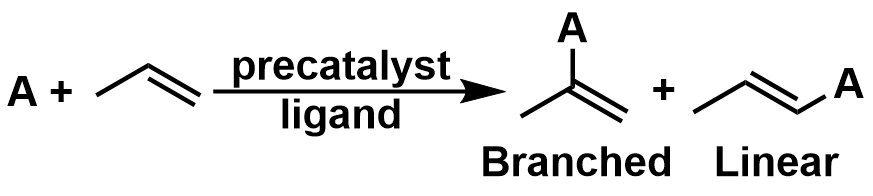
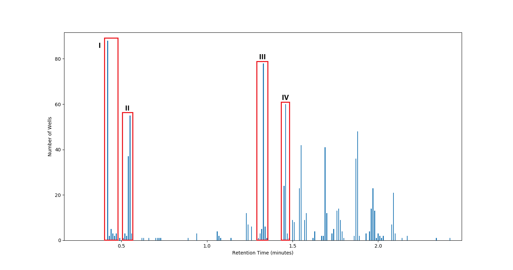

# Statement of Need

The advent of High Throughput Experimentation (HTE) techniques has enabled
scientists from many disciplines to drastically increase the pace of discovery and
graduate from resource-intense, Edisonian science. In particular, the pairing of HTE
with gas chromatography (GC) has been of special interest [@Shevlin:2017], as it enables
the simultaneous execution of dozens or even hundreds of experiments. The implementation 
of such groundbreaking technologies in the academic space, however, has been hampered
by the lack of automation in the retrieval, processing, and interpretation of data. 
Commercial solutions are prohibitively expensive, closed-source, and often require
purchase of additional HTE equipment, meaning existing technologies cannot be carried forward.

# Summary

`Crow` seeks to remedy this problem by making HTE practical in an academic setting.
The package is platform-agnostic and highly customizable, allowing users to modify
key application parameters through a simple *config.yaml* file. Data is retrieved
via the *xml* format, in which nearly all lab equipment can export data. The core functionality
of `Crow` is accessed via a simple multi-tab graphical user interface, enabling walk-up
use for non-coding users post-configuration. Commonly accessed internal functions are separate
so they may be compiled into bytecode via CPython to decrease execution time after initial
compilation.

`Crow` is currently used in the University of Delaware High Throughput Experimentation Facility [@udel_HTE:2019].
In its current GC implementation, it has three tabs which access its main functions: 
**Pre-Pull**, **Pull**, and **Present**. The applications of these three tabs are explored below.

# Case Study: Optimization of a Metal-Catalyzed Coupling Reaction
Below is the schema for a stereo-selective coupling reaction currently under investigation
in the Don Watson Lab:

This reaction was run in a 96 well microtiter plate with a unique ligand in each well, ranging from simple
tri-alkyl phosphines to various *phos-*ligands. The plate is processed via a GC
with an autosampler attachment, which individually characterizes each well in sequence. Each resulting
chromatogram is exported into the *xml* format to a networked drive where `Crow` is able to retrieve files
and begin processing.

**Pre-Pull** is a diagnostic tool to aid in automated peak retrieval. It identifies all peaks present
in the data set and generates a histogram of elution times. In this reaction, the injection peak (I) was tightly
grouped across all wells at approximately 0.4 minutes and was followed closely by an internal standard (II) at 0.5.
The next two groups (III and IV) represent the Linear and Branched products at 1.3 and 1.5 minutes, respectively.

**Pull** is responsible for retrieving only the desired peaks from the data files. Users specify a set of
retention times and tolerances for expected eluates based on the output of **Pre-Pull**. The set of *xml*
files are then rapidly parsed, retrieving only some given value for peaks which the user requested,
in this case area. The resulting data is output to the universal *csv* format for easy manipulation in
the user's software of choice.

Peak picking is complicated by the presence of instrument noise and unexpected eluates, so `Crow` allows
the user to pick one of three implemented methods: keep all peaks which fall within their given interval,
keep the peak which is closest to the center of the interval, or keep whichever peak has the maximum area.

Once the data retrieved by **Pull** has been manipulated to indicate yields, selectivity, or other values,
the user returns to `Crow` and uses **Present**. This ingests *csv* files and generates graphics resembling
a multi-well plate of pie charts where each pie represents the outcome of a single well (see \autoref{fig:Example Single Well}). `Crow` generates
graphics for 96 and 24 well plates, includes 3 pre-configured color pallattes or custom color selection, and
can filter data and color or shade individual wells accordingly (see \autoref{fig:Example **Present** output}).
All plots and graphics are created with 'matplotlib' [@Caswell:2020] which enables exporting in multiple common
image formats.

The above graphic indicated to researchers that multiple wells were candidates for acheieving the desired
high selectivity (B8, C1, C2, etc.) at scale. Though the results of these indivudal experiments were similar,
the structures of the ligands were completely divergent, which forced researchers to draw new conclusions
about how structure affects selectivity. The graphic showed which ligands achieved high selectivity in the
opposite direction, which also provides motivation for future projects on the same reaction.

# Acknowledgements

We acknowledge funding from the University of Delaware Undergraduate Research Program Stakem Grant.

# References
